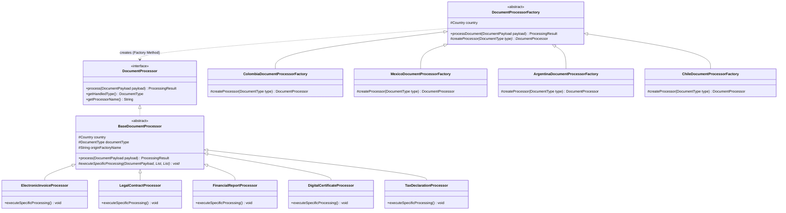

# GlobalDocs Solutions — Enterprise Document Processing System
### Software Patterns Workshop: Real-World Case Study on the Factory Method Pattern

[](https://openjdk.org/)
[](https://en.wikipedia.org/wiki/Factory_method_pattern)
[](#architecture-and-design-pattern)
[](#test-suite-and-verification)
[](#skjian-palette-web-interface)

---

## 1. Case Study Overview & Business Context

**GlobalDocs Solutions** is a multinational enterprise specialized in processing, certifying, and auditing large volumes of mission-critical corporate documents across Latin America (**Colombia**, **Mexico**, **Argentina**, and **Chile**).

### Enterprise Specifications & Challenges
- **Daily Volume Target:** Over **50,000+ daily documents** requiring high-throughput, low-latency, and concurrent thread processing.
- **Multinational Scope:** Each country operates under distinct legal and fiscal regulations imposed by governmental authorities:
  - 🇨🇴 **Colombia:** Regulated by **DIAN** (*Dirección de Impuestos y Aduanas Nacionales*). Requires mandatory **CUFE** (*Código Único de Factura Electrónica*) hashing, NIT validation, and strict electronic invoicing rules.
  - 🇲🇽 **Mexico:** Regulated by **SAT** (*Servicio de Administración Tributaria*). Enforces **CFDI 4.0** standards, **UUID Timbre Fiscal**, RFC homoclave validation, and NOM-151 digital preservation.
  - 🇦🇷 **Argentina:** Regulated by **AFIP** (*Administración Federal de Ingresos Públicos*). Requires **CAE** (*Código de Autorización Electrónico*) stamping, CUIT structure validation, and FACPCE reporting frameworks.
  - 🇨🇱 **Chile:** Regulated by **SII** (*Servicio de Impuestos Internos*). Mandates **DTE** (*Documento Tributario Electrónico*) Folio allocation, RUT check-digit verification, and Law 19.799 advanced signatures.
- **Document Typologies (5 types):** Electronic Invoices (*Facturas Electrónicas*), Legal Contracts (*Contratos Legales*), Financial Reports (*Reportes Financieros*), Digital Certificates (*Certificados Digitales*), and Tax Declarations (*Declaraciones Tributarias*).
- **Supported File Formats (7 formats):** `.pdf`, `.doc`, `.docx`, `.md`, `.csv`, `.txt`, `.xlsx`.
- **System Capabilities:** Concurrent batch processing engine with error containment (isolated failures without crashing batch pipelines).

---

## 2. Architecture and Design Pattern

The core problem in multinational document processing is that business logic, regulatory rules, tax rates, and fiscal stamping vary radically by country and document type. Hardcoding conditional `if/switch` blocks leads to tight coupling, violating the **Open/Closed Principle (OCP)** and **Single Responsibility Principle (SRP)**.

To solve this, the system implements the **GoF Factory Method Pattern**:



### Pattern Role Breakdown
1. **Product Interface (`DocumentProcessor`):** Defines the signature contract for all concrete document processors (`process(DocumentPayload payload)`).
2. **Concrete Products (`BaseDocumentProcessor` subclasses):**
   - `ElectronicInvoiceProcessor`: Calculates jurisdictional VAT (DIAN 19%, SAT 16%, AFIP 21%, SII 19%) and verifies accounting totals.
   - `LegalContractProcessor`: Validates clause integrity, digital signature laws (Ley 527 Colombia, NOM-151 Mexico, Ley 25.506 Argentina, Ley 19.799 Chile).
   - `FinancialReportProcessor`: Verifies IFRS/NIIF accounting standards and fiscal year disclosures.
   - `DigitalCertificateProcessor`: Validates PKI certificate chains against authorized national Root CAs (ONAC, PSC, Ente Licenciante, CMF).
   - `TaxDeclarationProcessor`: Audits jurisdiction tax returns (DIAN Form 110, SII F22) and income thresholds.
3. **Creator Hierarchy (`DocumentProcessorFactory`):**
   - Abstract Creator declaring the factory method: `protected abstract DocumentProcessor createProcessor(DocumentType type);`
   - Implements the **Template Method** `processDocument(DocumentPayload payload)` which orchestrates validation, processor instantiation, domain execution, and stamping.
4. **Concrete Creators:**
   - `ColombiaDocumentProcessorFactory`: Produces processors configured with DIAN fiscal parameters and CUFE hashes.
   - `MexicoDocumentProcessorFactory`: Produces processors bound to SAT CFDI 4.0 regulations and UUID stamps.
   - `ArgentinaDocumentProcessorFactory`: Produces processors configured for AFIP CAE certification.
   - `ChileDocumentProcessorFactory`: Produces processors configured for SII DTE Folio validation.
5. **Registry Provider (`CountryFactoryProvider`):** Resolves the appropriate concrete factory based on target country dynamically.

---

## 3. Comprehensive Class Catalog (~28 Classes)

The codebase is organized into clean, specialized Java packages:

| Package | Class / Interface | Pattern Role / Responsibility |
|---|---|---|
| `com.globaldocs.model` | `Country` *(Enum)* | Supported nations (Colombia, Mexico, Argentina, Chile) with tax authorities and currencies. |
| `com.globaldocs.model` | `DocumentType` *(Enum)* | 5 document categories (Electronic Invoices, Legal Contracts, Reports, Certificates, Taxes). |
| `com.globaldocs.model` | `DocumentFormat` *(Enum)* | 7 supported file formats (`.pdf`, `.doc`, `.docx`, `.md`, `.csv`, `.txt`, `.xlsx`) with MIME types. |
| `com.globaldocs.model` | `ProcessingStatus` *(Enum)* | Outcome states: `SUCCESS`, `WARNING`, `REJECTED`, `FAILED`. |
| `com.globaldocs.model` | `DocumentPayload` *(Class)* | Immutable builder model carrying document metadata, country, format, tax ID, and payload. |
| `com.globaldocs.model` | `ProcessingResult` *(Class)* | Pipeline output containing regulatory stamp, audit trail checkpoints, latency, and status. |
| `com.globaldocs.model` | `BatchSummary` *(Class)* | Aggregated metric summary for concurrent batch jobs (throughput, counts, durations). |
| `com.globaldocs.exception` | `GlobalDocsException` *(Class)* | Root domain runtime exception. |
| `com.globaldocs.exception` | `ValidationException` *(Class)* | Thrown when preliminary structure, format, or payload fields fail checks. |
| `com.globaldocs.exception` | `RegulatoryComplianceException` *(Class)* | Thrown when country authority rules (DIAN, SAT, AFIP, SII) are breached. |
| `com.globaldocs.core.validation` | `ValidationRule` *(Interface)* | Functional interface for modular document validation rules. |
| `com.globaldocs.core.validation` | `FormatComplianceValidator` *(Class)* | Validates whether a file format is legally permissible for the given type and country. |
| `com.globaldocs.core.validation` | `RegulatoryComplianceEngine` *(Class)* | Validates fiscal IDs (NIT, RFC, CUIT, RUT) and generates official regulatory stamps. |
| `com.globaldocs.core.document` | `DocumentProcessor` *(Interface)* | **Abstract Product** in Factory Method. Contract for processing any document. |
| `com.globaldocs.core.document` | `BaseDocumentProcessor` *(Abstract)* | Abstract Product base implementing validation template pipeline, audit logging, and stamping. |
| `com.globaldocs.core.document` | `ElectronicInvoiceProcessor` *(Class)* | **Concrete Product** for Electronic Invoices and national VAT calculations. |
| `com.globaldocs.core.document` | `LegalContractProcessor` *(Class)* | **Concrete Product** for Legal Contracts and national commerce codes. |
| `com.globaldocs.core.document` | `FinancialReportProcessor` *(Class)* | **Concrete Product** for Financial Reports and IFRS/NIIF standards. |
| `com.globaldocs.core.document` | `DigitalCertificateProcessor` *(Class)* | **Concrete Product** for Digital Certificates and PKI trust chains. |
| `com.globaldocs.core.document` | `TaxDeclarationProcessor` *(Class)* | **Concrete Product** for Tax Declarations and income tax schedules. |
| `com.globaldocs.core.factory` | `DocumentProcessorFactory` *(Abstract)* | **Abstract Creator** declaring `createProcessor(DocumentType)` and orchestrating the pipeline. |
| `com.globaldocs.core.factory` | `ColombiaDocumentProcessorFactory` *(Class)* | **Concrete Creator** for Colombia (DIAN jurisdiction). |
| `com.globaldocs.core.factory` | `MexicoDocumentProcessorFactory` *(Class)* | **Concrete Creator** for Mexico (SAT jurisdiction). |
| `com.globaldocs.core.factory` | `ArgentinaDocumentProcessorFactory` *(Class)* | **Concrete Creator** for Argentina (AFIP jurisdiction). |
| `com.globaldocs.core.factory` | `ChileDocumentProcessorFactory` *(Class)* | **Concrete Creator** for Chile (SII jurisdiction). |
| `com.globaldocs.core.factory` | `CountryFactoryProvider` *(Class)* | Registry/Resolver mapping `Country` to its concrete `DocumentProcessorFactory`. |
| `com.globaldocs.batch` | `BatchProcessingEngine` *(Class)* | Concurrent thread-pool engine for high-volume batch execution with error containment. |
| `com.globaldocs.util` | `JsonUtils` *(Class)* | Lightweight, zero-dependency JSON parser and serializer for standard library Java. |
| `com.globaldocs.server` | `GlobalDocsHttpServer` *(Class)* | Embedded REST API & static asset web server powered by `com.sun.net.httpserver`. |
| `com.globaldocs` | `GlobalDocsApplication` *(Class)* | Main entry point supporting both Web Server (`--port 8080`) and standalone CLI demo (`--cli`). |
| `com.globaldocs.test` | `GlobalDocsTestRunner` *(Class)* | Automated test runner verifying all 11 core integration specifications. |

---

## 4. Document Types and Formats Compatibility Matrix

| Document Type | Primary Purpose | Legally Permitted File Formats | Prohibited Formats |
|---|---|---|---|
| **Electronic Invoice** | Taxable commercial sales ledger | `.pdf`, `.xlsx`, `.csv` | `.md`, `.doc`, `.txt` *(rejected by DIAN/SAT)* |
| **Legal Contract** | Commercial agreement & jurisdiction binding | `.pdf`, `.docx`, `.doc`, `.md`, `.txt` | `.csv`, `.xlsx` |
| **Financial Report** | Balance sheets & IFRS disclosures | `.pdf`, `.xlsx`, `.csv`, `.docx` | `.md`, `.txt` |
| **Digital Certificate** | PKI cryptographic key & accreditation | `.pdf`, `.txt`, `.md` | `.csv`, `.xlsx`, `.doc` |
| **Tax Declaration** | Annual fiscal filing & withholding return | `.pdf`, `.xlsx`, `.csv`, `.txt` | `.md`, `.doc` |

---

## 5. Country Regulatory Rules

```
┌───────────────┬───────────────┬─────────────────────────┬────────────────────────────┬──────────┐
│ Country       │ Authority     │ Tax Identifier (Regex)  │ Official Stamp Algorithm   │ VAT Rate │
├───────────────┼───────────────┼─────────────────────────┼────────────────────────────┼──────────┤
│ 🇨🇴 Colombia   │ DIAN          │ ^\d{9,10}(-\d)?$        │ CUFE (SHA-384 hex hash)    │ 19%      │
│ 🇲🇽 Mexico     │ SAT           │ ^[A-Z&Ñ]{3,4}\d{6}\w{3}$│ UUID CFDI 4.0 Timbre SAT   │ 16%      │
│ 🇦🇷 Argentina  │ AFIP          │ ^(20|23|24|27|30|33|34) │ CAE (14-digit authorization│ 21%      │
│ 🇨🇱 Chile      │ SII           │ ^\d{7,8}-[\dkK]$        │ DTE Folio (SII Timbre DTE) │ 19%      │
└───────────────┴───────────────┴─────────────────────────┴────────────────────────────┴──────────┘
```

---

## 6. Skijan Palette Web Interface

The web interface is styled strictly following the user-provided **Skijan** palette:
- **`#263A47`** — Deep Slate Navy *(Application canvas, dark gradients, container bases)*
- **`#4A5B6A`** — Slate Blue-Grey *(Cards, headers, primary buttons)*
- **`#728495`** — Cool Muted Slate *(Borders, badges, secondary elements)*
- **`#98A9BE`** — Soft Ice Slate Blue *(Hover states, icons, informational badges)*
- **`#B4C5D8`** — Light Pastel Frost Blue *(Active glows, highlight accents, high-contrast labels)*

### Interactive Web Features:
1. **Single Document Studio:**
   - Interactive jurisdiction selector with live flag cards and dynamic fiscal ID input adaptations.
   - Realistic preset loader: instant 1-click loading of Colombian Invoices, Mexican Contracts, Argentine Financial Balances, Chilean Certificates, and error injection scenarios.
   - Real-time audit checklist with verification steps, generated stamps, and latency timings.
2. **Batch Processing Center:**
   - Multi-document simulator (10, 25, 50, 100 documents) executing on background worker threads.
   - Real-time progress bar animation and throughput calculations (**600+ documents/sec**).
   - Error containment isolation: invalid items are flagged without interrupting remaining documents in the batch.
   - Interactive data table with status badges and full regulatory stamps.
3. **Factory Method Architecture Visualizer:**
   - Interactive visual diagram illustrating the GoF Creator vs Product hierarchies.
   - Dynamically highlights which Concrete Creator and Concrete Product are instantiated during pipeline execution.
4. **Regulatory Matrix Inspector:**
   - Live compliance cheat sheet showing tax authority decrees, regex patterns, and format requirements.

---

## 7. Setup, Build and Execution

### Prerequisites
- **Java Development Kit (JDK 17 LTS or higher, JDK 25 tested).**
- *Zero external build dependencies or internet downloads required!* The project utilizes pure Java standard libraries (`com.sun.net.httpserver`, `java.util.concurrent`, `java.security`).

### One-Click Windows Scripts
1. **Compile Application:**
   ```cmd
   compile.bat
   ```
2. **Run Web Server Dashboard (Port 8080):**
   ```cmd
   run-server.bat
   ```
   *Then open your browser at:* **`http://localhost:8080/`**
3. **Run Standalone CLI Demonstration:**
   ```cmd
   run-cli.bat
   ```
4. **Run Automated Test Suite:**
   ```cmd
   run-tests.bat
   ```

### Manual CLI Execution
```bash
# 1. Compile Java sources into bin/
javac -encoding UTF-8 -d bin src/com/globaldocs/**/*.java src/com/globaldocs/*.java

# 2. Run automated test suite
java -cp bin com.globaldocs.test.GlobalDocsTestRunner

# 3. Start Web Server
java -cp bin com.globaldocs.GlobalDocsApplication --port 8080

# 4. Or run CLI demo
java -cp bin com.globaldocs.GlobalDocsApplication --cli
```

---

## 8. REST API Reference

The embedded Java HTTP server exposes RESTful endpoints:

### 1. `GET /api/health`
Returns system heartbeat and JVM memory metrics.
```json
{
  "status": "UP",
  "freeMemoryMb": 238,
  "totalMemoryMb": 248,
  "timestamp": 1789158743306
}
```

### 2. `GET /api/config`
Lists supported countries, document types, formats, and authority metadata.

### 3. `POST /api/documents/process`
Dispatches a single document through the Factory Method pipeline.
- **Request Body:**
  ```json
  {
    "documentId": "DOC-CO-01",
    "title": "Factura Venta DIAN 2026",
    "country": "COLOMBIA",
    "documentType": "ELECTRONIC_INVOICE",
    "format": "pdf",
    "taxIdentifier": "900123456-1",
    "amount": 2500000.0,
    "content": "Servicios de consultoria cloud"
  }
  ```
- **Response (200 OK):**
  ```json
  {
    "documentId": "DOC-CO-01",
    "documentTitle": "Factura Venta DIAN 2026",
    "country": "COLOMBIA",
    "countryDisplayName": "Colombia",
    "taxAuthority": "DIAN",
    "documentType": "ELECTRONIC_INVOICE",
    "documentTypeDisplay": "Electronic Invoice",
    "format": "pdf",
    "status": "SUCCESS",
    "regulatoryStamp": "CUFE-5C18DBC1F03938EE702E084DAD66A3B41A2E322130F3942C",
    "authorityValidationMessage": "Certified by DIAN (Colombia)",
    "factoryUsed": "ColombiaDocumentProcessorFactory",
    "processorUsed": "ElectronicInvoiceProcessor",
    "processingTimeMs": 17,
    "auditLogs": [
      "Initializing ElectronicInvoiceProcessor for document [DOC-CO-01] targeted at COLOMBIA",
      "Format verification passed: .pdf is certified for Electronic Invoice in COLOMBIA",
      "Regulatory compliance verified with DIAN authority standards",
      "Processing invoice amount: 2500000.00 COP",
      "Calculated regulatory tax rate for Colombia: 19% (Tax: 475000.00 COP, Total: 2975000.00 COP)",
      "Official DIAN regulatory stamp applied: CUFE-5C18DBC1F03938EE702E084DAD66A3B41A2E322130F3942C"
    ],
    "warnings": [],
    "errors": []
  }
  ```

### 4. `POST /api/documents/batch`
Executes concurrent batch processing across thread pool workers with error containment.
- **Request Body:** JSON array of document payload objects.
- **Response:** `BatchSummary` with throughput rate (`docs/s`), failure counts, and item results.

---

## 9. Test Suite and Verification

The automated test runner (`com.globaldocs.test.GlobalDocsTestRunner`) validates:
1. `[PASS]` FactoryProvider resolves Colombia Factory
2. `[PASS]` FactoryProvider resolves Mexico Factory
3. `[PASS]` FactoryProvider resolves Argentina Factory
4. `[PASS]` FactoryProvider resolves Chile Factory
5. `[PASS]` Colombia Invoice: Generates valid DIAN CUFE stamp
6. `[PASS]` Mexico Contract: Enforces SAT / NOM-151 compliance
7. `[PASS]` Argentina Report: Enforces AFIP CAE compliance
8. `[PASS]` Chile Certificate: Enforces SII DTE timestamping
9. `[PASS]` Error Handling: Rejects illegal format `.txt` for Colombian Electronic Invoice
10. `[PASS]` Error Handling: Rejects invalid Mexican RFC format
11. `[PASS]` Batch Engine: Concurrent thread pool execution with error containment
